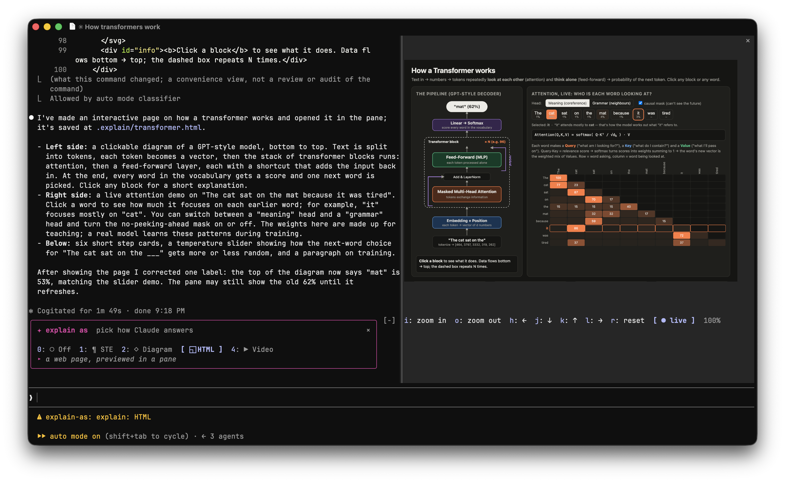

# explain-as

A Claude Code mod that asks Claude for its output in a format that is easier to understand. It is based on the idea that we will spend more and more time reading LLM output, so the output format matters.



| Format | What Claude does |
| --- | --- |
| `ste` | Writes about 80% of the way to [ASD-STE100](https://www.asd-ste100.org/) Simplified Technical English: short sentences, active voice, simple words |
| `diagram` | Draws a Mermaid diagram, rendered as a picture in a pane you can zoom and pan, with short captions |
| `html` | Builds a self-contained, interactive HTML page: a preview in the pane, and the live page in your browser |
| `video` | Makes a 3Blue1Brown-style animated explainer in plain JavaScript (canvas) that opens and plays in Chrome, narrated with your device's text-to-speech (ElevenLabs only if you set `ELEVENLABS_API_KEY`); a Record button saves it as .webm |

## Usage

```
/explain                           # open the picker band above the prompt
/explain html                      # every answer as an HTML page from now on
/explain off                       # back to normal
/explain diagram how git rebase works   # one answer only
```

In `html` and `diagram` mode Claude writes the page (or Mermaid source) to `.explain/` in your project. The mod screenshots it with headless Chrome, Chromium or Brave and shows the picture in a pane inside Claude Code (needs a terminal with image support, such as Ghostty, kitty, iTerm2 or WezTerm). In the pane, focus it (click or ctrl+x tab) and use `i`/`o` to zoom in and out, `h` `j` `k` `l` (or the arrow buttons) to scroll, `r` to reset, and `v` (**● live**) to open the real, interactive page in the browser; on macOS that Chrome tab refreshes by itself each time Claude updates the page; zoom uses `ffmpeg` if it is installed. `/explain show` reopens the last preview, and the pane links to the full interactive page.

The picker band shows `explain as [Off] [STE] [Diagram] [HTML] [Video]`. Click a format, or focus the band (ctrl+x tab) and press 0-4. The active format is highlighted, and the status line shows it.

## Install

Needs **Claude Code 2.1.287 or later** (check with `claude --version`). The desktop app bundles its own Claude Code, so it works there once the app ships 2.1.287+; update the app if `/explain` does not show up. `/explain` appears after the session's first message. In Claude Code run:

```
/plugin marketplace add Sumit189/explain-claude-mod
/plugin install explain-as@explain-as
```

Then start a new session. To try a local copy without installing: `claude --plugin-dir ./explain-claude-mod`.

This uses Claude Code function hooks, which are in early access. Run the tests with `claude plugin test ./explain-claude-mod`.
